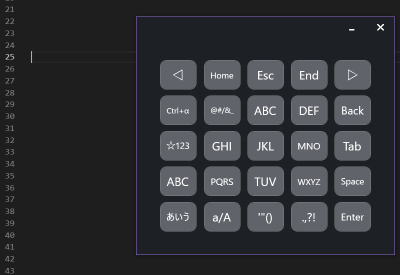

# Flickey
https://github.com/aridai/Flickey  
フリック入力可能なソフトウェアキーボード。  

## 使用方法
キーをタッチすることで文字を入力することができます。  
指をスライドやホールドさせることで文字の選択ができます。

## 動作環境
タッチパネルを持つWindows 10での動作を想定しています。  
.NET Framework 4.7を推奨しています。

## 使用ライブラリ
* ReactiveProperty  
  (https://github.com/runceel/ReactiveProperty)

* Prism  
  (https://github.com/PrismLibrary/Prism)