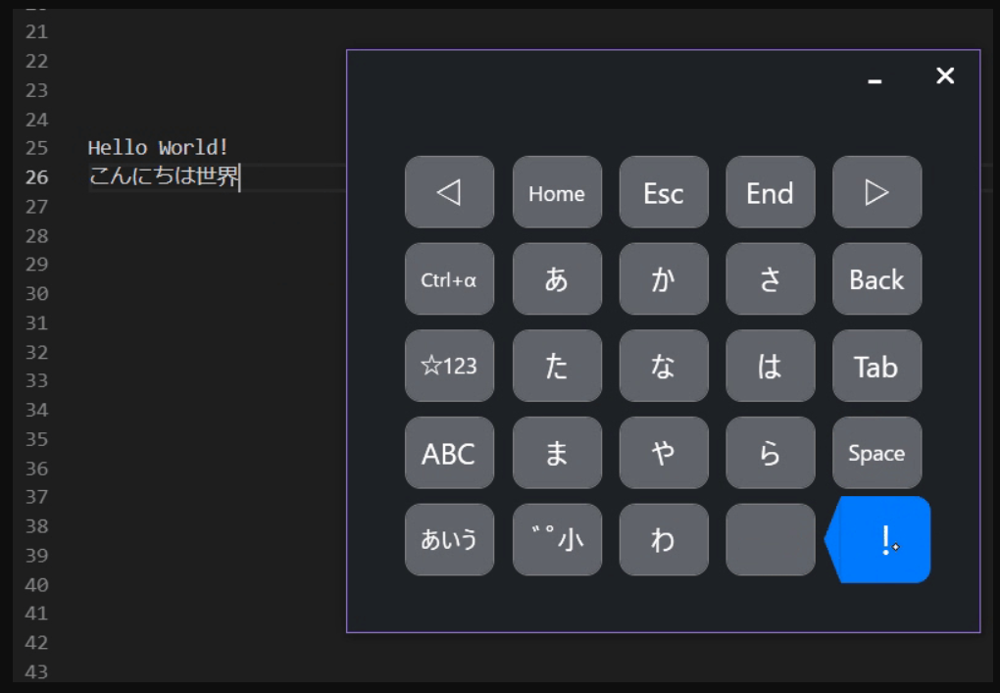
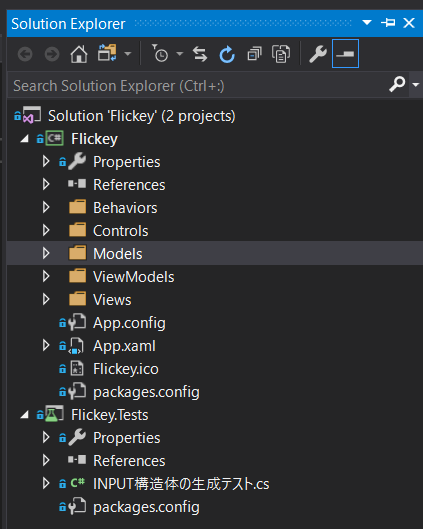
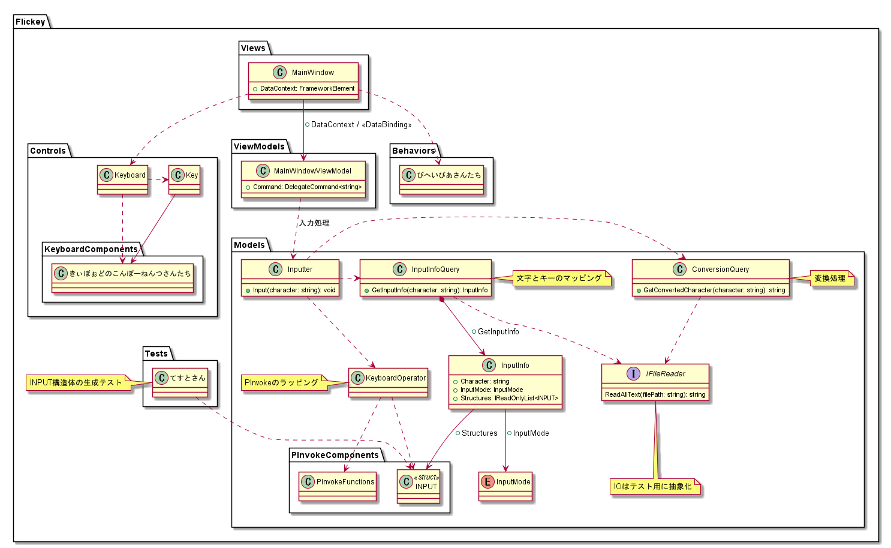
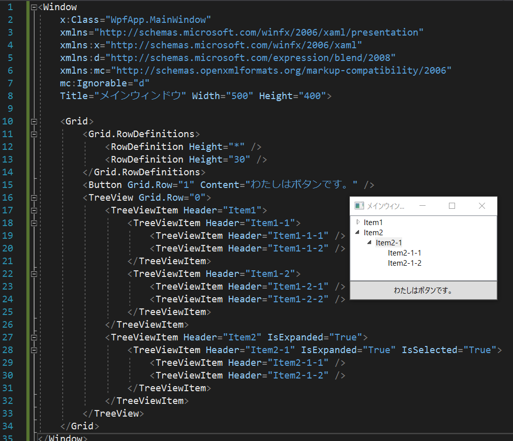
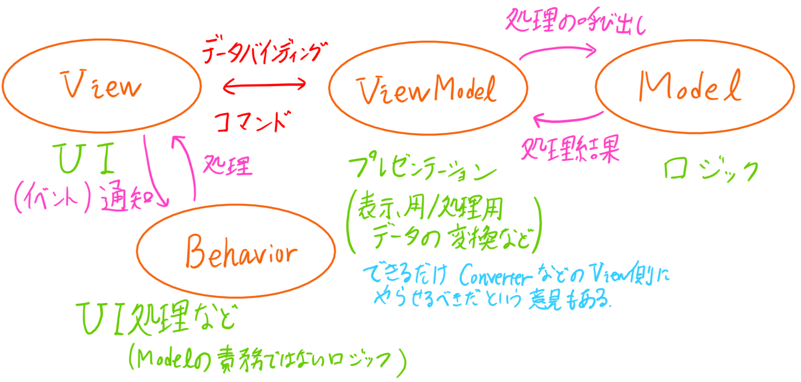
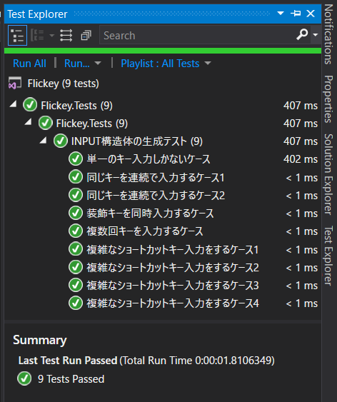

<!-- Marp v0.0.14 for Windows x64 -->
<!-- https://yhatt.github.io/marp/ -->

<!-- $theme: gaia -->
<!-- $size: 4:3 -->

# ソフトウェア工学
## オブジェクト指向プログラミング

#### 4I No.4 aridai
##### (GitHub: @aridai / Twitter: @aridai_net)

---
<!-- page_number: true -->

## 今回話すこと

* できたもの
* 使ったもの
* プロジェクトの構成
* WPFについて (フレームワーク/アーキテクチャ)
* Rxについて
* P/Invokeについて
* テストについて
* 感想

---

## できたもの
* フリック入力可能なソフトウェアキーボード。
* Windows 10で動く。 (タッチパネルが必要。)
* 指をスライドさせたり、ホールドさせたりして入力できる。




---

## できたもの
設計図と配布物は設計図共有サイトでMITライセンスで公開します。  
https://github.com/aridai/Flickey


---

## 使ったもの
* 言語: C# 7.3
* GUIフレームワーク: WPF
* テストフレームワーク: MsUnit
* ライブラリ: Prism / ReactiveProperty
* IDE: Visual Studio Community 2017
* バージョン管理: Git + git-flow + 設計図共有サイト

---

## プロジェクトの構成
Visual Studioソリューションかこんな感じに。

<div style="display: flex; justify-content: space-between;">
  <div>
    <ul>
      <li>2プロジェクト。<br>(WPFApp + UnitTest)</li>
      <li>MVVMパターン +<br>Behaviorパターン。</li>
      <li>UI部分はユーザコントロールとして作成。</li>
    </ul>
  </div>
  <div style="text-align: right;">
    
  </div>
</div>

---

### プロジェクトの構成
クラス図はこう。一応、頭の片隅に**SOLID原則**を。



---

## WPFについて
**Windows**アプリケーションのフレームワーク。
**UI**を**XAML**を使って記述する。



---

## WPFについて
* **MVVMパターン**
  **Model**・**View**・**ViewModel**の3つの層に分けて  
  設計・実装を行うアーキテクチャパターン。

* **Behaviorパターン**
  **View**のUI処理を**Behavior**の層で行う。(語弊あり)

* **データバインディング**  
  一方のデータが変更されると他方のデータも更新される仕組み。  

* **コマンド**
  操作とそのパラメータ (引数/利用可能状態) をまとめて1つのものとして扱ったもの。

---

## WPFについて
今回の開発も**MVVMパターン**に従って、画面部分と処理部分と分けて作るようにした。  
具体的には、キーボードの制御 (表示の切り替えなど) に関しては、キーの入力処理が知らなくてもいいようになっている。(疎結合でみんな幸せ!)



---

## Rx (Reactive Extensions) について
**LINQ**の**observer-pattern**版みたいなやつ。  
キーボードのタイミング制御などが複雑になりそうだったため、これを使うと、時間やスレッドをまたぐ制御が楽になった。

```CSharp
//  長押し判定の例
var holdDetection = operationTarget
    .Select(target => target.deviceId)  //  データの選択
    //  IDが有効で、
    .Where(id => id != null)            //  通知のフィルタ
    //  一定時間経過したら、
    .Delay(timeOut)                     //  時間差通知
    .ObserveOnDispatcher()              //　スレッド変更
    .Where(id => id == deviceId)
    //  長押し判定にする。
    .Select(_ => OperationType.Hold);
```

---

## P/Invokeについて
* **P/Invoke**  
  **C#** から **C++** のコードを呼び出す機能。(語弊あり)

**IME**の処理をするには、**Win32 API** を利用しなくてはならなく、それは **C++** で書かれているため、**P/Invoke** を利用して呼び出した。(語弊あり)

```CSharp
[DllImport("user32.dll")]
public static extern int SendMessage(
    IntPtr hWnd, uint Msg, uint wParam, int lParam);
    
[DllImport("user32.dll")]
public static extern int SendInput(
    int nInputs, INPUT[] pInputs, int cbSize);
```

---

## テストについて

<div style="display: flex; justify-content: space-between;">
  <div>
    <ul>
      <li>MsUnitを利用した。<br>(xUnitと迷った。)</li>
      <li>入力データの生成が<br>正しくできているか<br>をテストした。</li>
      <li>先にテストケースを<br>書いて実装した。</li>
      <li>テストが通ると<br>めっちゃ気持ちいい!</li>
    </ul>
  </div>
  <div style="text-align: right;">
    
  </div>
</div>

---

## 感想
前期に座学でやったことを意識しながら開発ができてよかったと思いまぁす。

今回は規模的/時間的にできなかったけれども、**TDD** や **DIコンテナ**、**CIサーバ** なども試してみたいと思った。

タッチパネル付きのWindowsPCを持っている人は是非使ってみてね。

**issues** / **pull requests** 大歓迎でぇす。
リポジトリ: https://github.com/aridai/Flickey